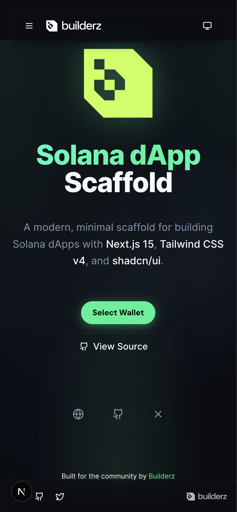
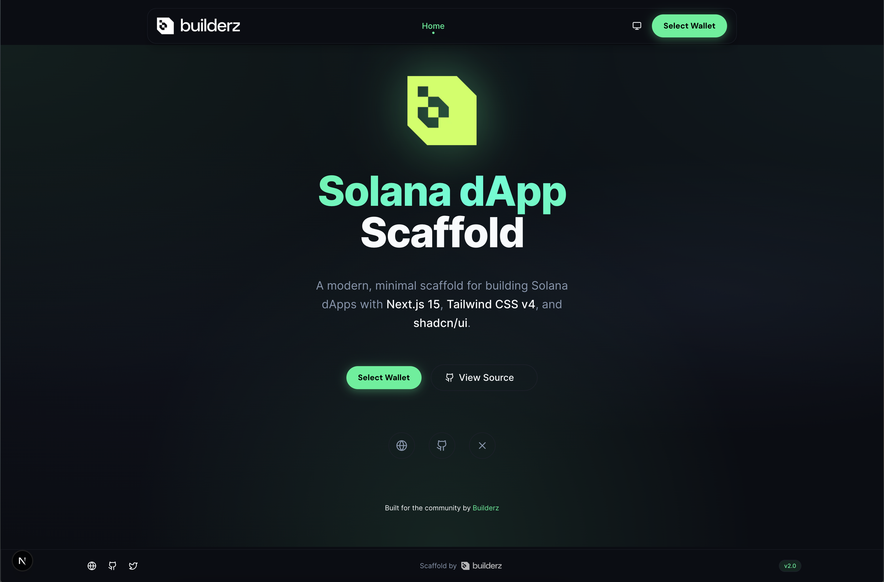

# Builderz Solana dApp Scaffold (Nextjs14, App Diretory, Typescript, TailwindCSS, MaterialUI, web3.js)

This is our open source [Next.js](https://nextjs.org/) , [Solana](https://github.com/solana-labs ) dApp Scaffold for the community and whole ecosystem - without much fluff and just the essentials. 💪

Feel free to use it as a starting point for your next Solana project - we will and already use it for our developments.

Also feel free to send us feedback, open an issue or even PR and contribute by creating your own components, refactoring or other improvements.

The Scaffold has Material-UI v5 theme activated, detecting your devices preferred color scheme and ready to set with a dark/light mode schwitch in the AppBar.tsx.

We didn't want to include too much as from our experience we tend to delete most stuff we found in a scaffold.

You can find a preview below:

Responsive                     |  Desktop
:-------------------------:|:-------------------------:
  |  

## Packages included and set up

- Nextjs13 ("old" folder structure using pages - we will release an "app" branch as soon as it's more stable)
- Typescript (tsconfig.json set up and ready to go)
- Material-UI (Dark/Light Mode, Preferred Mode, Switch in AppBar, layout.tsx as well as themes.tsx with predefined dark/light theme.s)
- react-dom ()
- Solana web3.js (Solana Wallet Adapter with auto detect of installed wallet extensions)
- TailwindCSS (set up and ready to go)
- Daisy-UI

Furthermore you will find a globals.css file with predefined settings. Next to the basics you mostly want to set, we also added pre-defined so called "fluid fonts" for all headings and body text. According to the values you tweak, your fonts will scale according to your device width and resolution.
This means you wont have to set any TailwindCSS fontSizes in your work unless you want something look different than it normally does.

You will also find the CSS for two variations of the Button styling, "glow" and "glow-on-hover" - just tweak them to your needs and add one of those classes to your buttons if you like.

## Feel free to use it as a starting point for your next Solana project

Also feel free to send us feedback, open an issue or even PR and contribute by creating your own components, refactoring or other improvements.

## Getting Started

Create a project using this example:

```bash
npm i or yarn install (we suggest npm though as the packages were installed with it)
```

```bash
remove .example from .env.example and add your RPC endpoint to NEXT_PUBLIC_HELIUS_URL=""  
```

```bash
npm run dev or yarn dev (same here depending on what you chose above)
```

```bash
remove .example from .env.example and add your RPC endpoint to NEXT_PUBLIC_HELIUS_URL=""  
```

```bash
npm run build or yarn build (production build)
```

You can start editing the page by modifying `pages/index.tsx`. The page auto-updates as you edit the file.
If you want to add a new page you just create another file in `pages` folder - we created a `basics.tsx` as an example for you, and also a `blog` folder for a dynamic routing example.

On `pages/_app.tsx`, you'll find `ThemeProvider` for light/dark mode, "ContextProvider", and "WalletProvider" wrapping your app, this is necessary for everything to work.

Although we are using Nextjs13 we are using the "old" folder structure as long as the "app" structure is in experimental mode.
We will add a `app-structure` branch as soon as its running more stable soon.

## Learn More

To learn more about Solana and Next.js, take a look at the following resources:

- [Next.js Documentation](https://nextjs.org/docs) - learn about Next.js features and API.

- [Solana Documentation](https://docs.solana.com/) - learn about Solana features.
- [Anchor Language Book](https://book.anchor-lang.com/) - learn about Solana features.
- [Rust Anchor Documentation](https://docs.rs/anchor-lang/latest/anchor_lang/) - learn about Solana features.
- [Material-UI Getting Started](https://mui.com/material-ui/getting-started/overview/) - learn about Material-UI features.
- [TailwindCSS Documentation](https://tailwindcss.com/docs/guides/nextjs) - learn about TailwindCSS features.


You can check out [the Cynova GitHub organization](https://github.com/cynova-enterprise) - your feedback and contributions are welcome!

## Join our Discord

For any questions, suggestions, join our discord at [https://discord.gg/cynova-enterprise](https://discord.gg/cynova-enterprise).
